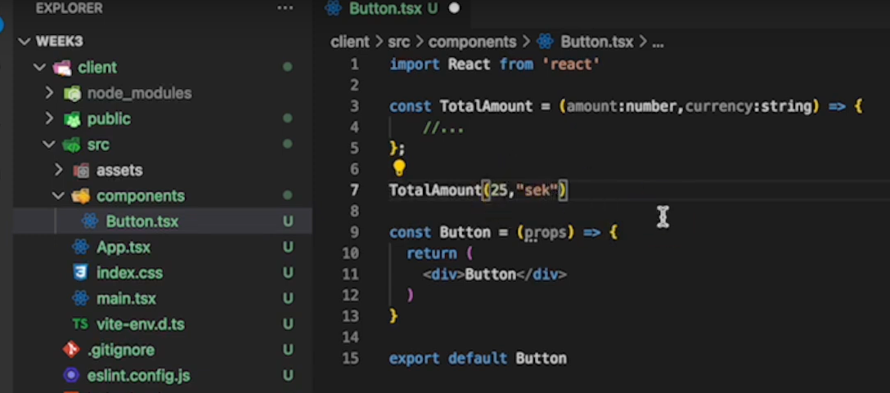
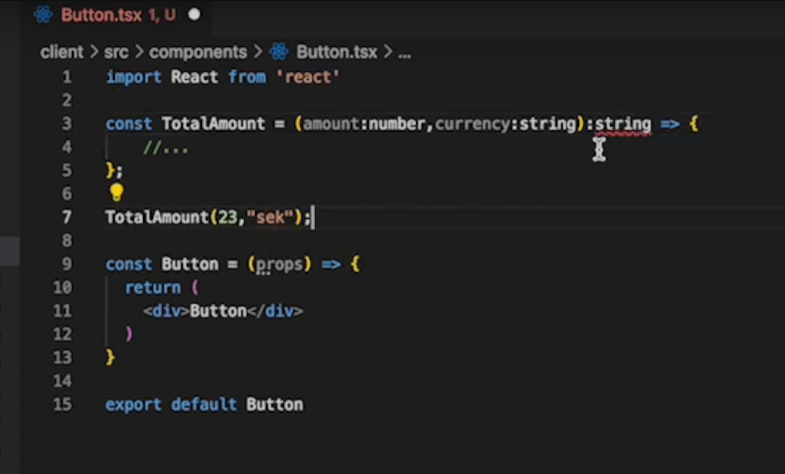
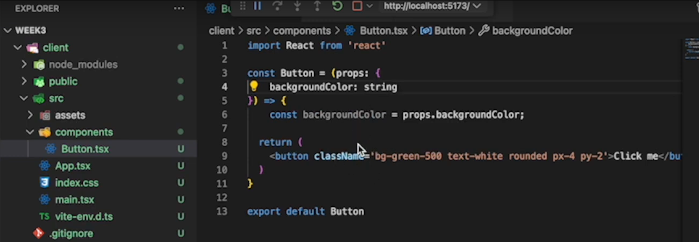
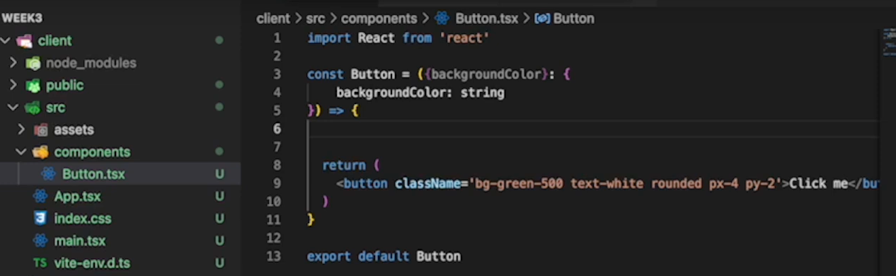
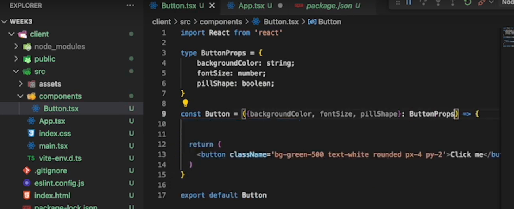
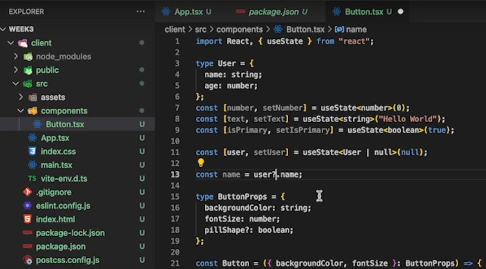

# NOTES

##create a React project

- Run `npm create vite@latest`
- Add project name : <project-name>
- choose React
- Choose TypeScript
- cd <project-name>
- Run `npm i`

## Run project in dev mode

- Run `npm run dev``

## Installing Tailwind

Follow steps from page [Install Tailwind CSS with Vite](https://tailwindcss.com/docs/guides/vite)

## creating components

- type at the top rafce to get a component scalfold --> enter
- Adding types to a function:
  

- Adding types to a function that returns:
  

- Adding types to props:
- Option1:
  

- Option2:
  

- Option3:
  

- Adding a custom type using union:
  

- Adding types to useState:
  

# TypeScript course

https://learntypescript.dev/

## Standard TypeScript Types

- Date: lets us strongly-type date variables and gain useful intellisense on the JavaScript Date object.

- Any: could be used when we are unsure of the type of value. The problem with any is that no type checks will be carried out on values of type any.

- Void: only really useful for function return types. It can be inferred, but we can explicitly define it on functions if we prefer.

- Array:

- Tuple: are a convenient way of strongly-typing small and obvious data structures. It is essential to use a type annotation with these rather than rely on type inference.

- Never: is used to represent a type of value that will never occur. It is useful to explicitly flag areas of code that shouldn’t be reached, for example when creating conditional types

- Unknown: it is similar to the any type but is type-safe. It is required to validate the input when using unKnown types.

-Enum: represents named constants. Enum values are zero-based auto-incrementing numbers by default.

## Interfaces

```
    interface ButtonProps {
    text: string,
    onClick: () => void
    }
```

# Extending interfaces

Interfaces can extend other interfaces to inherit all the properties and methods from the interface being extended

```
interface InterfaceA extends InterfaceB {
    ...
}
```

## Interface for functions

```
interface Log {
  (message: string): void
}

const log: Log = (message: string) => {
  console.log(message);
}
```

The interface called Log represents the arrow function log.

## Tutorial link
- Typescript and React: https://www.youtube.com/watch?v=j6wqBRdH5bg
- Lesson 3 Vanilla JS to React: https://www.youtube.com/watch?v=kOLLHTjYYAs
