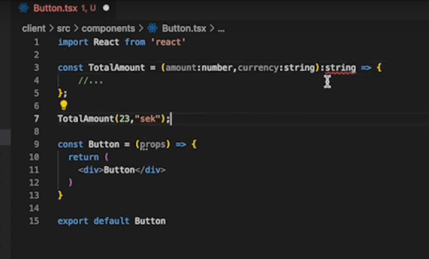

# NOTES

[week 3 Typescript and React](https://www.youtube.com/watch?v=j6wqBRdH5bg)

##create a React project

- Run `npm create vite@latest`
- Add project name : <project-name>
- choose React
- Choose TypeScript
- cd <project-name>
- Run `npm i`

## Run project in dev mode

- Run `npm run dev``

## Intaling Tailwind

Follow steps from page [Install Tailwind CSS with Vite](https://tailwindcss.com/docs/guides/vite)

## creating components

- type at the top rafce to get a component scalfold --> enter
- Adding types to a function:
  

- Adding types to a function that returns:
  

- Adding types to props:
- Option1:
  

- Option2:
  

- Option3:
  

- Adding a custom type using union:
  

- Adding types to useState:
  
